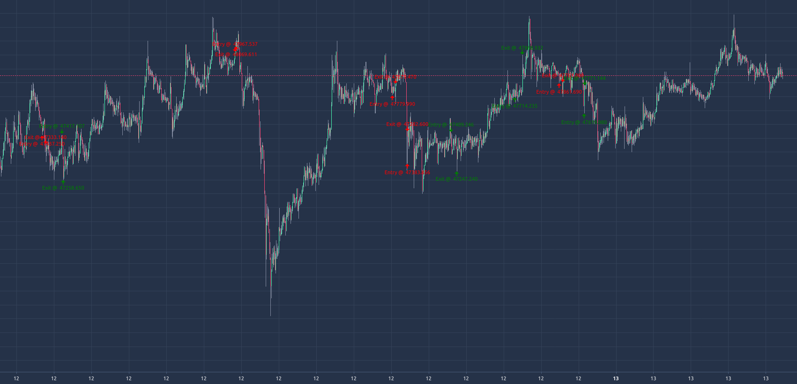

# Trade Visualizer



## Installation

```bash
npm install
```

## Running

- Place the trade json in the public folder under the name `data.json`. It
  should follow the following format:

```js
{
    "candles": [
        {
            time: 1529884800,
            open: "2134.234",
            high: "2354",
            low: "234",
            close: "2365" 
        },
        ...
    ],
    "orders": [
        {
            time: 1529884800,
            position:
            color:
            shape:
            id:
            text:
            size:
        }
    ]
}
```

- Note: timestamp should be formatted as mentioned
  [here](https://github.com/tradingview/lightweight-charts/blob/master/docs/time.md)
- Each order is a marker object as defined
  [here](https://github.com/tradingview/lightweight-charts/blob/master/docs/series-basics.md#setmarkers)

- Build the docker image

```bash
docker build -t synalytica/viz-engine .
```

- Run the image

```bash
docker run -e DEBUG=1 -v $PWD:/app -p 8000:3000 --rm -it synalytica/viz-engine
# or in production
docker run -e DEBUG=0 -v $PWD:/app -p 80:3000 --rm -d -it synalytica/viz-engine
```
